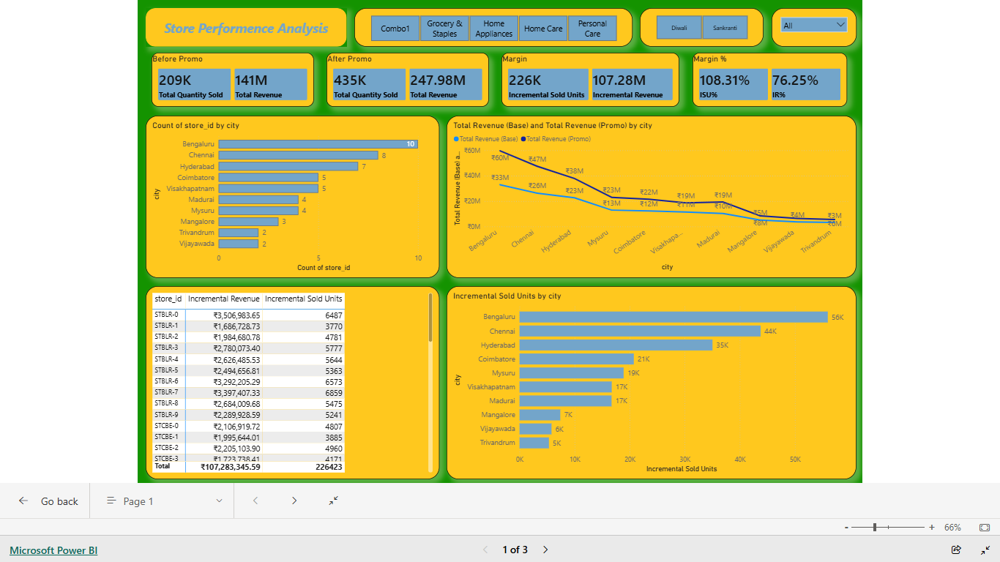

# 📊 AtliQ Mart: Retail Promotion Analysis (FMCG Domain)

## 📋 Executive Summary
AtliQ Mart, a retail giant in Southern India, conducted massive promotional campaigns during Diwali 2023 and Sankranti 2024. The objective of this project is to provide Sales Director **Bruce Haryali** with tangible insights into which promotions performed well and which did not to inform future strategies. Analysis reveals that while **BOGOF** and **500 Cashback** successfully drove revenue growth, high-percentage discounts (% OFF) often resulted in negative incremental revenue.

---

## 🚀 Key Performance Indicators (KPIs)
Based on the dashboard analysis, the overall performance metrics are as follows:
* **Total Revenue (Before Promo):** ₹141M
* **Total Revenue (After Promo):** ₹247.98M
* **Incremental Revenue (IR):** ₹107.28M
* **Incremental Sold Units (ISU):** 226K
* **ISU%:** 108.31%
* **IR%:** 76.25%

## 📊 Dashboard Preview

## 🔍 Deep-Dive Insights (Insight Buckets)

### 1. Promotion Type Effectiveness
* **Top Performers:** **500 Cashback** (₹91M IR) and **BOGOF** (₹22M IR) were the clear winners in generating incremental revenue.
* **Underperformers:** Promotions like **50% OFF**, **33% OFF**, and **25% OFF** resulted in **negative** incremental revenue. While they increased sales volume, they did not translate into a financial gain for the company.

### 2. Category & Product Performance
* **High-Impact Category:** The **Combo1** category was the most successful, contributing ₹91M in incremental revenue.
* **Star Product:** The `Atliq_Home_Essential_8_Product_Combo` alone generated ₹157.95M in total revenue after promotions.
* **Volume Driver:** `Atliq_Farm_Chakki_Atta` led in terms of unit sales but showed only moderate revenue lift.

### 3. Geographical Insights (City Analysis)
* **Market Leaders:** **Bengaluru** (10 stores) and **Chennai** (8 stores) led the charts in both store count and revenue generation.
* **Opportunity Areas:** **Vijayawada** and **Trivandrum** saw the lowest incremental sold units (5K-6K), suggesting a need for localized strategies.

---

## 🛠️ SQL Ad-hoc Request Solutions
The following business questions from senior executives were answered using optimized SQL queries:

1.  **High-Value BOGOF Identification:** Identified products with a base price > 500 featured in BOGOF deals (e.g., Atliq_Double_Bedsheet_set) to evaluate heavy discounting.
2.  **Store Presence Overview:** Confirmed Bengaluru and Chennai as the cities with the highest store density.
3.  **Financial Impact Analysis:** Compared total revenue before and after campaigns in millions to assess fiscal success.
4.  **Category Success (Diwali):** Ranked categories by ISU% during the Diwali campaign, with Home Appliances (244.22%) taking the top spot.
5.  **Product Optimization:** Identified the Top 5 products by Incremental Revenue Percentage (IR%), led by `Atliq_Home_Essential_8` at 151.96%.

---

## 🏗️ Technical Stack
* **Database:** MsSQL (Data analysis and ad-hoc reporting) 
* **Visualization:** Power BI (Interactive dashboard development) 
* **Skills:** SQL Window Functions (Ranking), DAX, Data Modeling, and Business Analysis.

---

## 💡 Strategic Recommendations
1.  **Shift Discounting Strategy:** Replace low-performing % discounts (25%, 33%) with **BOGOF** or **Cashback** models, as they provide a healthier balance between volume and margin.
2.  **Localized Marketing:** Invest in targeted marketing for underperforming cities like Vijayawada and Trivandrum to boost penetration.
3.  **Scale Combo Deals:** Given the massive success of the Combo1 category, expand these bundles to other high-margin products in future campaigns.

---
*Developed by Neeraj Singh (Data Analyst at AtliQ Mart)*
<a href="https://www.linkedin.com/in/neerajsinghdatanerd/" target="_blank">[LinkedIn Profile Link]</a>
<a href="https://app.powerbi.com/view?r=eyJrIjoiZDBhY2RkMjItZDdjYy00ZDcxLWIwNzctNDk4MjJkZjllYzU2IiwidCI6ImRmODY3OWNkLWE4MGUtNDVkOC05OWFjLWM4M2VkN2ZmOTVhMCJ9">[Power BI Report Link]</a>
